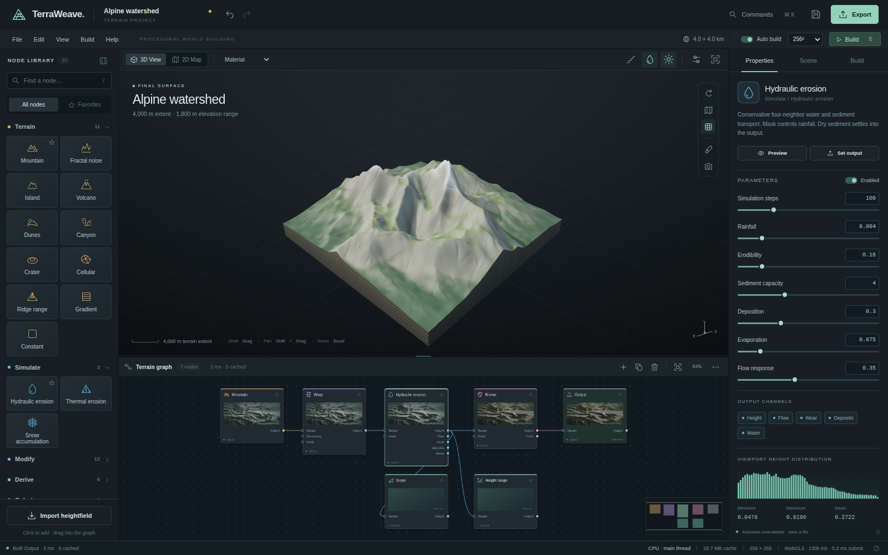

# TerraWeave

**An original procedural terrain studio, built with HTML, JavaScript, WebGPU compute and ten reusable ES-module packages.**



Create a landform, connect simulation and transformation nodes, paint non-destructive sculpt strokes, author terrain colors, and export real heightfields and meshes. The interface is an operational editor, not a static mockup. There are no runtime CDN requests, external fonts, analytics, API keys, accounts or third-party JavaScript dependencies.

This is an original Gaea-inspired implementation, not Gaea source code, a QuadSpinner product, or a claim of complete Gaea feature/algorithm/file-format parity. See [capability boundaries](docs/CAPABILITIES.md) and [validation evidence](docs/VALIDATION.md).

## Run

Node.js 20 or newer is sufficient. Installation is not required for building or running the app.

```sh
npm run build
npm start
```

Open **http://localhost:4173**. The prebuilt `dist/` is included, so `npm start` also works immediately after extraction.

For a single-file distribution, use **`dist/TerraWeave.html`**. It embeds the application, CSS, package implementations, shader sources, and a blob-backed CPU worker. Serving it from localhost or HTTPS gives the browser access to secure-context capabilities. Opening it directly from a filesystem is browser-dependent; the CPU/software fallbacks do not require a WebGPU adapter.

To host statically, upload the **contents of `dist/`** to the document root. Relative imports also support subdirectory hosting, including a GitHub Pages project site. No build server or backend API is required. To use a different local port:

```sh
PORT=8080 npm start
```

Windows PowerShell: `$env:PORT=8080; npm start`.

## What is implemented

- **37 functional nodes**: 11 terrain generators, hydraulic and thermal erosion, snow, 12 modifiers, six derived fields, two colorizers, import, sculpt and output.
- **A real graph editor**: port wiring, cycle rejection, pan/zoom, minimap, node previews, multi-selection, duplicate/copy/paste, disconnect, deletion and undo/redo.
- **Actual simulation**: conservative four-neighbor hydraulic water/sediment transport and talus relaxation. Erosion produces independent height, flow, wear, deposition and water fields.
- **GPU-resident graph evaluation**: storage buffers between native compute nodes, ping-pong simulation, min/max reduction, asynchronous readback, cancellation, LRU caching and reference-counted field ownership. D8 flow, sculpt and image resampling deliberately use a CPU bridge.
- **3D and 2D viewing**: orbit/pan/zoom, terrain walls, material/clay/height/normal/wire views, contours, directional shadows, ambient-occlusion approximation, water, exposure and sun settings. WebGPU is primary; WebGL2 and an original software triangle rasterizer provide fallbacks.
- **Authoring workflow**: six procedural starter worlds, schema-driven property controls, local project autosave, portable JSON, lossless supported PNG16 height import, RAW import, brush replay, command palette and responsive touch layout.
- **Real exports**: PNG16, RAW16, unclipped FLOAT32 RAW and OpenEXR, normal/albedo/splat PNGs, OBJ, GLB and ZIP asset bundles with projects and metadata.

Resolution presets are **64²–2048²**. The default interactive build is 256². Viewport mesh density is independent of field resolution. Higher-resolution simulation changes sampling and is not a tiled/out-of-core renderer.

## First terrain

Start with **Alpine watershed**. Change the selected **Hydraulic erosion** node's Erodibility or Simulation steps and press Build (or enable Auto). Use its **Flow**, **Wear**, **Deposits** and **Water** preview buttons to inspect real diagnostic fields. Drag a library node onto the graph and connect an output port to an input port. The **Sculpt** viewport tool inserts a replayable brush node; one complete brush gesture is one undo step. Choose **Export** for a heightmap, mesh or complete asset bundle.

The six example projects in `examples/` are the same portable graph format used by the app. `examples/exports/` contains a reproducibly generated 128² alpine asset set, including meshes and EXR.

## Standalone packages

| Package | Responsibility |
|---|---|
| `@terraweave/math` | Integer-hash noise, fractals, cellular fields, interpolation, statistics, camera matrices |
| `@terraweave/core` | Validated DAG/project model, raster ownership, history, cancellation and signals |
| `@terraweave/nodes` | All node schemas, parameter defaults, ports, categories and starter graphs |
| `@terraweave/kernels` | CPU reference kernels, simulations and module-worker transport |
| `@terraweave/webgpu` | WGSL kernels, dispatch, simulation passes, reduction and readback |
| `@terraweave/engine` | Scheduling, content signatures, incremental cache, result lifetimes and metrics |
| `@terraweave/renderer` | WebGPU/WebGL2/software renderers and orbit camera |
| `@terraweave/ui` | Original SVG icons, controls, dialogs, menus, thumbnails, histogram and theme CSS |
| `@terraweave/graph-ui` | DOM/SVG graph editor, wiring, navigation, clipboard and graph CSS |
| `@terraweave/io` | Binary encoders/decoders, mesh builders, asset bundles and IndexedDB storage |

These are separately packageable local packages, **not packages claimed to be published on npm**. Each has its own package manifest, public ESM entry point, MIT license and README. The application imports these actual implementations rather than duplicating their logic. Import `@terraweave/ui/styles.css` and `@terraweave/graph-ui/styles.css` when using the visual packages with a bundler.

```sh
npm run pack
# Creates artifacts/terraweave-<package>-0.1.0.tgz for all ten packages.
```

To consume the archives in another npm project, install the set of local tarballs together so their `@terraweave/*` dependencies resolve locally. Source-tree imports can alternatively use the rewritten relative modules under `dist/packages/` with no bundler. API examples are in [architecture and integration](docs/ARCHITECTURE.md).

## Validation

```sh
npm test                              # 66 Node kernel, graph, engine and format checks
python tests/browser.py --url http://localhost:4173
node scripts/generate-examples.mjs
python tests/external_readers.py      # Optional independent readers
```

The browser runner requires Python Playwright and an installed Chromium executable; set `CHROMIUM` or pass `--browser`. The external readers require Pillow, NumPy, OpenCV and trimesh. Those are **optional developer/test tools**, not app dependencies.

This delivery passed **66 Node tests**, **24 browser workflow checks**, **5 independent interoperability checks**, and **12 isolated package-integration checks**. Browser evidence here covers the CPU main-thread + software-renderer fallback. The execution environment blocked navigations and did not expose WebGPU/WebGL or IndexedDB to the inline document. **Native GPU execution, WebGL rendering, module-worker transport and persistent IndexedDB execution were not validated here.** Included WGSL is not described as hardware-certified.

Open **http://localhost:4173/diagnostics.html** on a normal local browser to execute the native capability gate. It tests all 37 operations (including the explicit bridges), compares CPU/GPU samples with recorded tolerances, renders every display pipeline, and tests worker/database round trips. Save its JSON report for bug reports. `SKIP` means unavailable, never passed.

## Source layout

```text
app/                  HTML editor, original styles and orchestration
packages/             Ten independently consumable libraries
scripts/              Dependency-free build, static linker, server and pack scripts
examples/             Six projects and interoperable export fixtures
tests/                Reproducible tests and machine-readable evidence
docs/                 Architecture, capability matrix, validation and screenshots
dist/                 Ready-to-host modules and self-contained TerraWeave.html
```

## Licensing and reference

MIT for the original code and assets in this repository. No proprietary Gaea source, textures, icons or project files are included. The workflow reference is [QuadSpinner's official Gaea documentation](https://docs.gaea.app/using/index.html); native GPU behavior follows the [WebGPU](https://www.w3.org/TR/webgpu/) and [WGSL](https://www.w3.org/TR/WGSL/) specifications. See [THIRD_PARTY.md](THIRD_PARTY.md).
